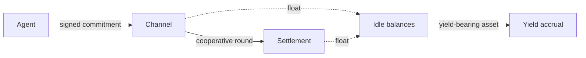

Ryvo is built on a simple premise: **repeated machine payments should not be modeled as a stream of independent on-chain transfers.** Once the same parties interact thousands or millions of times, settlement becomes a systems problem, not a checkout problem.

## The settlement cost floor

When every API call, tool invocation, or agent action is settled as its own transaction, each interaction inherits the full cost of settlement:

- a transaction fee
- block time
- confirmation overhead

That cost is acceptable when payments are large or infrequent. It is a structural problem when payments are small, frequent, and between the same counterparties, exactly the shape of agent-driven commerce.

Per-payment settlement creates a cost floor that is independent of the underlying work. A single inference call, a single RPC request, or a single data lookup may be worth fractions of a cent, yet still pay the settlement cost of an ordinary transfer.

## What "cooperative scaling" means

Ryvo decouples payment **execution** from payment **settlement**:

- Execution happens off-chain through signed cumulative commitments.
- Settlement happens later on-chain, against the newest valid state.

That separation unlocks three compounding compression paths, each built on the one before it:

1. **Latest-commitment settlement.** Many off-chain updates between one payer and one payee compress into a single settled cumulative amount.
2. **Bundle settlement.** One payee can batch many independent payer-signed commitments in one settlement transaction.
3. **Cooperative clearing rounds.** Several participants co-sign a single shared round that advances every included channel in one transaction.

Direct settlement is always available as a fallback. Cooperation is optional, when it happens, it is signaled by a shared signed message rather than by handing funds to an operator.

## Cooperation is a choice, not a requirement

Not every Ryvo payment is cooperative.

A single payer can open a one-way payment channel, sign cumulative commitments, and let the payee settle later without asking anyone to co-sign each update. That path alone already removes the per-interaction transaction cost for the most common case.

Cooperation starts when two or more participants agree on a shared state update. In bilateral and multilateral clearing, participants sign one shared message so several channels can be advanced together. This is the densest settlement mode, but it is not a prerequisite to using the protocol.

## Why this matters

Machine-to-machine commerce creates dense, repeated payment graphs. Ryvo treats this as a compression problem: keep micropayments off-chain as cumulative channel updates, then settle many channels together when participants cooperate.

Ryvo's contribution is simple:

- Repeated payment relationships are modeled as long-lived channels with explicit balances and explicit signed state.
- Payment execution is fast and off-chain.
- Settlement is deferred and compressed.
- The base layer stays non-custodial, balances live in program-owned state.

This is the model that makes small, frequent, machine-initiated payments economically practical without moving trust into an operator's private ledger.

## Where to read next

- [Design principles](/thesis/design-principles) - the non-negotiable properties Ryvo preserves
- [Roadmap](/thesis/roadmap) - how the protocol evolves without changing the model
- [Protocol overview](/getting-started/protocol-overview) - the on-chain objects and flows
